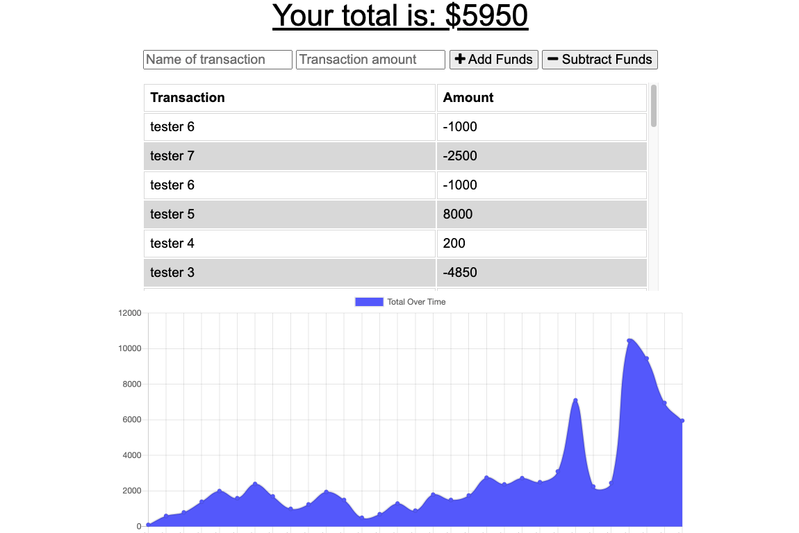
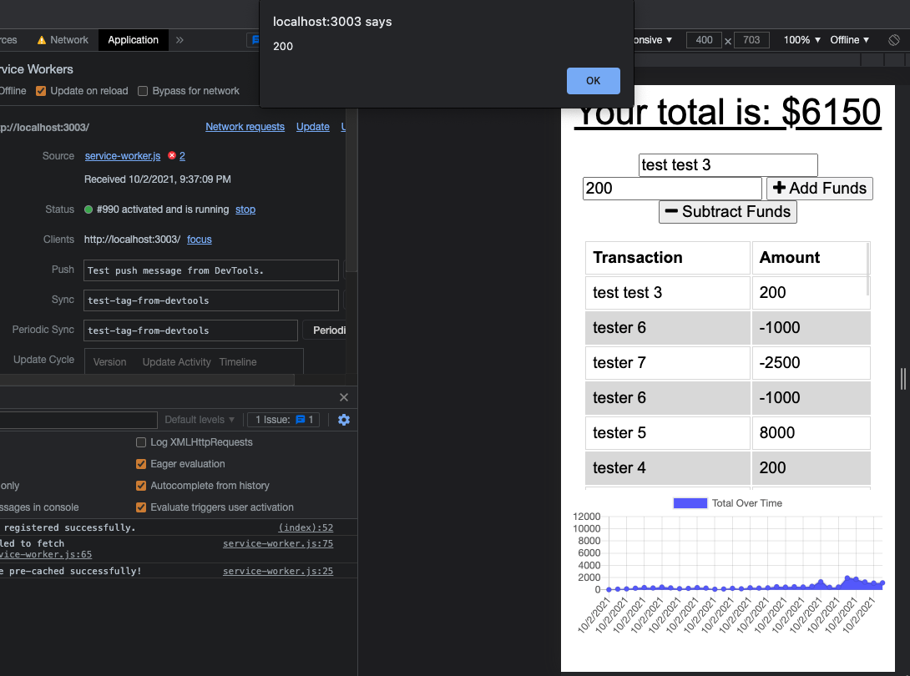
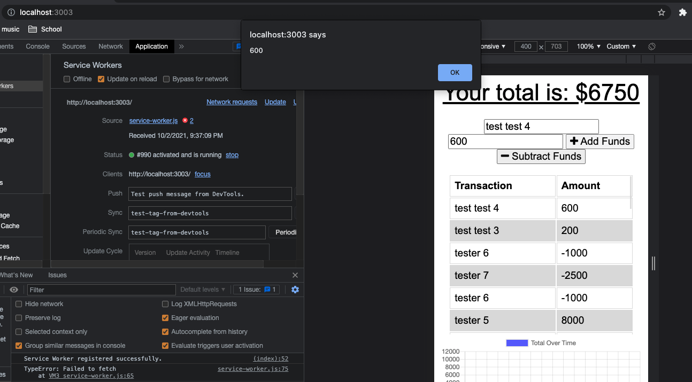

# budget-tracker

## Table of Contents

* [Description](#description)
* [Deployment](#deployment)
* [Built With](#built-with)

## Description

A user can track their budget with this Progressive Web Application. Any given user can enter deposits and expenses that are tracked on a table by value and time. The total funds avaibable are updated at the top of the application. This application can be downloaded to a device or remain on the web. If the application loses connection, the user can still enter transactions that will update when they re-connect to the internet. 

## Deployment

[Live-Application](https://polar-thicket-33051.herokuapp.com/)

The link above will take you to the live application to test functionality. The link below will take you to my repository.

[Github](https://github.com/fausnightm/budget-tracker)

## Built With

* HTML
* CSS
* Bootstrap
* JavaScript
* Node.js
* Express
* MongoDB
* Mongoose
* IndexedDB

## License

MIT

